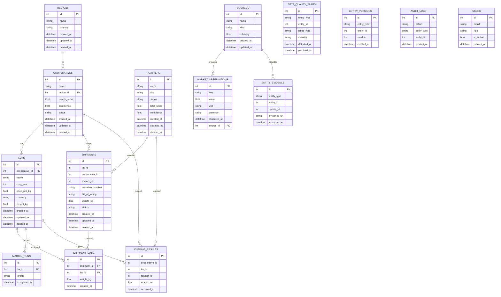

Data Model ERD and Migration Plan
Date: 2026-02-28

Current Core ERD (Mermaid)

Supporting Tables (Current)
- COFFEE_PRICE_HISTORY: historical prices for ML training
- FREIGHT_HISTORY: historical freight data for ML training
- QUALITY_ALERTS: quality change alerts (entity_type, entity_id)
- ENTITY_ALIASES: dedup and search aliases
- ENTITY_EVENTS: lifecycle events
- SENTIMENT_SCORES: sentiment signal
- NEWS_ITEMS: news ingestion
- REPORTS: generated reports
- WEB_EXTRACTS: web content extracts
- KNOWLEDGE_DOCS: knowledge base items
- ML_MODELS and ML_PREDICTIONS: model metadata and forecast outputs
- PERU_REGIONS: knowledge base for Peru regions (parallel to REGIONS)

Target Model Extensions (to close Milestone 1 gaps)
- DEALS: first-class transactions with pricing, volume, and closure status
- PRICE_QUOTES: per-lot or per-deal quotes linked to SOURCES
- TRANSPORT_EVENTS: normalized shipment events with timestamps and locations
- FIELD_EVIDENCE: field-level provenance (entity_type, entity_id, field_name)
- SOURCE_LINKS: explicit FK from DATA_QUALITY_FLAGS to SOURCES
- REGION_UNIFICATION: merge PERU_REGIONS into REGIONS or add FK references

Migration Plan (Phased)
1. Schema additions: Add deals table with FK to cooperative, roaster, lot. Add transport_events table with FK to shipments. Add price_quotes table with FK to lot and source. Add field_evidence table or extend entity_evidence with field_name.
2. Schema cleanup: Decide between shipment.lot_id and shipment_lots, then deprecate one. Convert shipment date strings to Date or DateTime. Add FK on data_quality_flags.source_id (nullable).
3. Data backfill: Migrate shipment.lot_id rows into shipment_lots if many-to-many is chosen. Parse shipment date strings into typed columns. Backfill price_quotes from lot.price_per_kg and market_observations.
4. Application alignment: Update services to read and write new tables. Update API schemas and routes for deals, quotes, transport events. Update UI to show normalized transport timelines and price lineage.
5. Validation and rollout: Add migration tests (upgrade and downgrade). Backfill verification queries and counts. Deploy with feature flags for new endpoints.
